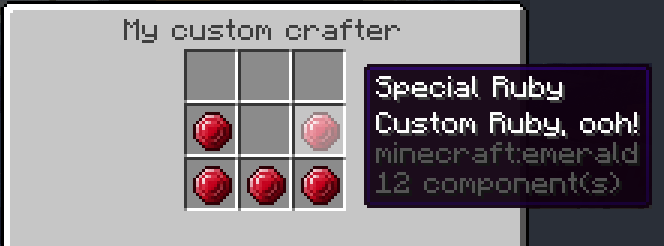

# Coming soon

## Project overview

This project aims to make complex (and simple) datapacks and resource packs using Python code to manage everything for you, in one centralised place.
It gained inspiration from IaC (Infrastructure as Code) and has a lot of the same benefits.
One of it's greatest features is the ability to abstract away common but difficult functionality, letting developers focus on making new and exciting content.
It automatically produces a large amount of content for you, such as loot tables, advancements, recipes, and more, with simple to use interfaces,
and no more researching the wiki/docs, just straight working content creation.


## Features

On top of existing features, such as adding a new item model or entity variant, it also has a lot of features you'd have to otherwise do yourself.
For example, a custom block feature, which also can generate naturally like ores! There's also a custom crafter, which allows for custom NBT/component crafting.
Finally (as I could name more features all day long), there's the reference book, which allows the users to easily see what you have made!
On top of that, you don't have to worry about having to upgrade your whole pack when a new version of Minecraft comes out, as it's all abstracted away, and
you just need to re-run the code to get the new content, just like magic!




## Installation

```bash
python -m pip install pypacks
```

Then, to get started, you can gain some inspiration from [here](https://github.com/UP929312/pypacks/blob/master/examples/development/main.py)
Which has lots of examples of how to use the library.

## Contributing

I'm incredibly open to contributions, and would love to see what you can make with this library.
If you have any issues, please raise them in the issues tab, and I'll get back to you as soon as possible.
I'm dedicating lots of time to this, so I'm sure I'll add your features/bug fixes quickly.

## Showcase

Made something cool with this? Send me a message and I'll include it here!


## Future plans

I will add everything that minecraft offers in datapacks and resource packs, and continue to add custom additions (like I have with raycasts).
I want this to be as easy to use, and the code as high quality as possible.

## Importing and Migrating

There's also functionality to load an existing datapack/resourcepack into a Pack object, using pack.from_existing_pack().
Use this to migrate!
